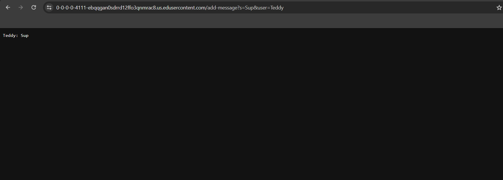
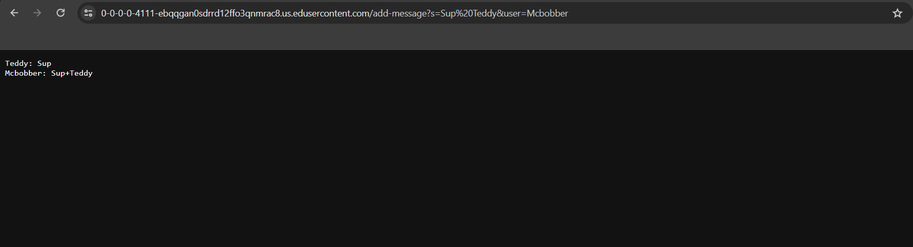
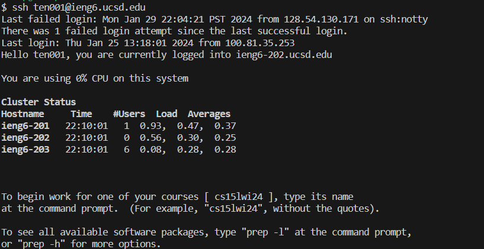

Part1 Start--------------------------------------------------
```
import java.io.IOException;
import java.net.URI;

class Handler implements URLHandler {
    // The one bit of state on the server: a number that will be manipulated by
    // various requests.
    String completeChat = "";

    public String handleRequest(URI url) {
        if (url.getPath().equals("/")) {
            return String.format("%s", completeChat);
        } else if (url.getPath().equals("/add-message")) {
            String[] parameters = url.getQuery().split("=");
            if(parameters[0].equals("s") && parameters[1].contains("&user") && parameters[2] != null){
                completeChat = completeChat.concat(String.format("%2$s: %1$s\n", parameters[1].substring(0, parameters[1].length() - 5), parameters[2]));
                return completeChat;
            }
        }
        return "404 Not Found!";
    }
}

class ChatServer {
    public static void main(String[] args) throws IOException {
        if(args.length == 0){
            System.out.println("Missing port number! Try any number between 1024 to 49151");
            return;
        }

        int port = Integer.parseInt(args[0]);

        Server.start(port, new Handler());
    }
}
```

1.
```
    String[] parameters = url.getQuery().split("=");
    if(parameters[0].equals("s") && parameters[1].contains("&user") && parameters[2] != null){
        completeChat = completeChat.concat(String.format("%2$s: %1$s\n", parameters[1].substring(0, parameters[1].length() - 5), parameters[2]));
        return completeChat;
    }
```
2.
The most important thing that is called in this method is
```
    String[] parameters = url.getQuery().split("=");
```
because it provides the user and the message sent given by parameters[1].substring(0, parameters[1].length() - 5), which is the message sent minus "&user", and paramters[2], which is the user.
3.
String completeChat gets its value changed to itself concatonated with the message and user with the new line command.


Steps 1 - 3 are the same but since "completeChat" has the new line argument at the end, the message and user will be on a new line when /add-message is called.

Part 1 End--------------------------------------------------

Part 2 Start--------------------------------------------------
1.
C:\Users\creep/.ssh/id_rsa.pub
2.
/home/linux/ieng6/oce/9p/ten001
3.

Part 2 End--------------------------------------------------

Part 3 Start--------------------------------------------------

From lab 2 and 3 there was a lot I learned, especially things about urls. I didn't know or realize that urls use the same system of navigating places as files. I also learned that creating and hosting servers is pretty easy given the resources.

Part 3 End--------------------------------------------------

